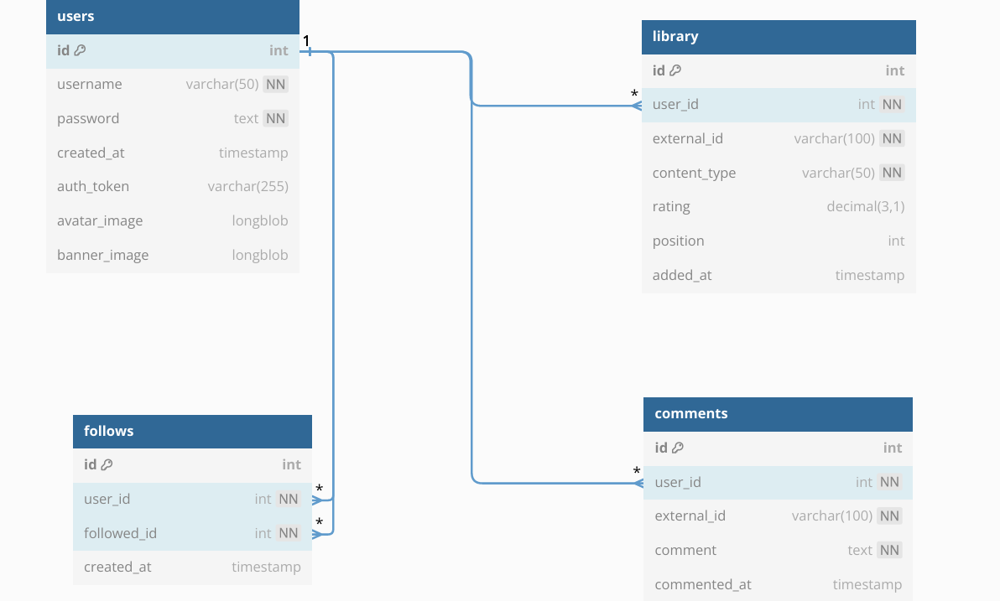
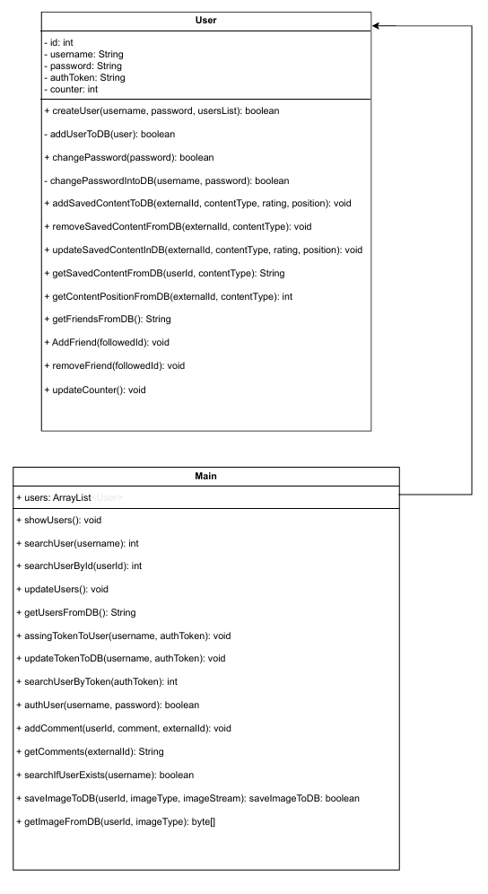

# Documentación Técnica del Proyecto

## 1. Análisis de Requisitos

### 1.1 Objetivos
- Desarrollar una aplicación web con interacción entre el backend, una base de datos y el frontend

### 1.2 Funcionalidades Principales
- Gestión de usuarios y autenticación
- Gestión de contenido por usuario (contenido guardado, puntuación añadida, comentarios por contenido...)
- Interfaz de usuario interactiva

## 2. Diseño del Sistema

### 2.1 Diagrama UML



### 2.2 Diagrama de Clases


## 3. Modelo de Datos

### 3.1 Estructura del Proyecto
```
/
├── front/              # Frontend
│   ├── src/             # Código fuente
|   |   |── js              # Javascript
|   |   |── styles          # Css
│   ├── pages/          # Páginas de la aplicación
│   └── media/          # Recursos multimedia
│
└── back/              # Backend (Java)
|   └── src/            # Código fuente del servidor
|
|── media              # Imagenes para el README.md y script de la base de datos
```

## 4. Guía de Instalación y Uso

### 4.1 Requisitos Previos
- Node.js (v14 o superior)
- Java JDK (v11 o superior)
- Git
- XAPP
- Eclipse
- Tomcat Ver-10.0.27

### 4.2 Instalación

#### Frontend
```bash
cd front
npm install
npm run dev
```

#### Backend
1. Importar en eclipse el pryecto. Recomendable importar únicamente la carpeta GAM/back
2. Añadir el proyecto de java al servidor Tomcat (Tomcat V. 10.0.27)
3. Ejecutar el servidor Tomcat

#### Base de datos
1. Iniciar el servidor de Apache y MySQL en XAPP
2. Añadir la base de datos en tu servidor MySQL, para añadirla se puede usar el script situado en GAM/media/BD-Script.sql

### 4.3 Configuración
1. Configurar las variables de entorno necesarias
2. Asegurarse de que los puertos necesarios están disponibles

### 4.4 Uso
1. Iniciar el servidor backend (Tomcat)
2. Iniciar la aplicación frontend
3. Acceder a la aplicación a través del navegador

### 4.5 Pruebas a realizar:
1. Puedes empezar accediendo con las credenciales:
    - **User**: Admin
    - **Password**: Admin123

Este usuario es un usuario de pruebas, el cual ya tiene añadido contenido y amigos

2. Puedes probar a:
    - **Añadir Contenido**: Haciendo click en el contenido se abrirá una ventana donde podrás elegir la nota que le das y si entra en tu top personal. Una vez puesta la información puedes pulsar en "Add to collection" para añadirlo a tu colección

    - **Añadir comentarios**: En la misma ventana de antes, en la parte inferior, podrás añadir comentarios y ver los de los demás usuarios.

    - **Configurar perfil**: Puedes cambiar la imagen de perfil haciendo click en ella en el apartado de tu perfil. También puedes cambiar la foto del banner haciendo click al icono de cámara arriba a la derecha del banner.

    - **Amigos**: Puedes añadir o eliminar amigos en la ventana "Friends". También puedes ver su contenido guardado y su puntuación. El usuario Admin tiene por defecto otros 2 usuarios de prueba agregados.
    
    - **Crear tu propio usuario**: Si cierras sesión en el botón "Logout" en la barra de navegación puedes crear un usuario propio.

## 5. Tecnologías Utilizadas

### Frontend
- Vite
- HTML5/CSS3
- JavaScript

### Backend
- Java 22.0